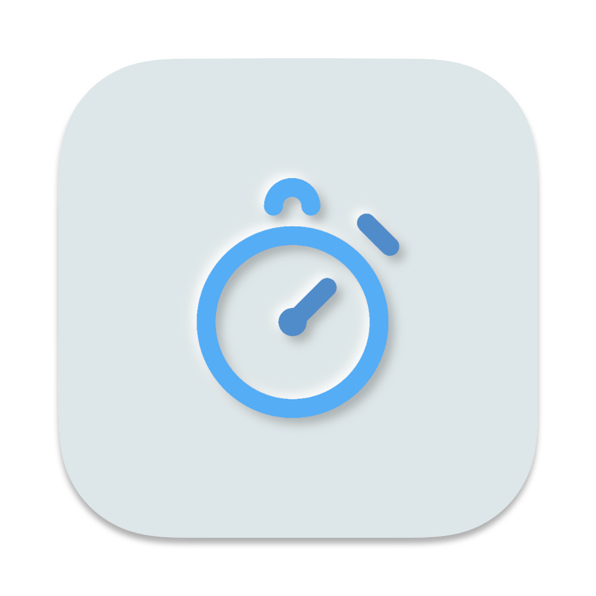
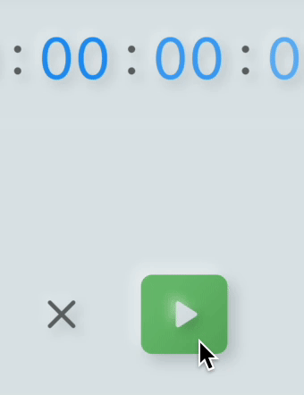
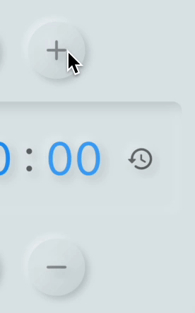
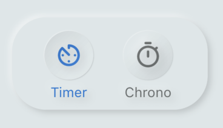

# Chroneum!

A nice Flutter Neumorphic timer and chronometer.

## Graphical Elements 
Small preview of some graphical elements
 

 

## More Details

The application is developed following the Neumorphic Design guidelines. (Further details are present in the code's comments)
(NOTE: This was meant as a school project, it's main purpose is NOT to be a good timer, but to express the UI/UX interface and the use of Dart Streams as well.)

How to:
- Set the timer: click on the + and - buttons to increment/decrement the values of hours, minutes and seconds
- Reset the timer: tap on the reload-time icon or, if running, on the X icon
- Reset the chrono: tap on the X icon

Backend:
- The Backend is developed in order to let the application set and sync herself based on the values retrieved from the stream. There are two streams: one for the timer and one for the chronometer.

Detailed Preview:
- The App is designed to garantuee a great UX combined with a satisfying UI. If leaving the timer's counter empty, the START and reset buttons are unavailable and therefore flatten down. At the end of the timer's countdown a short ringtone is played.
The User Interface is very simple and intuitive, realised in order to be coherent with the innovative Neumorphic Design style, with the associated animations too.
In this interface, every color or graphical detail (such as button depth) is assigned and updated dynamically by the relative methods.

### Detailed (Technical) Documentation's path

[doc/api/index.html](doc/api/index.html)

### Credits

Developer's accounts:
- [GitHub - AleDipa](https://github.com/aledipa)
- [GitLab - AleDipa](https://gitlab.com/AleDipa)
